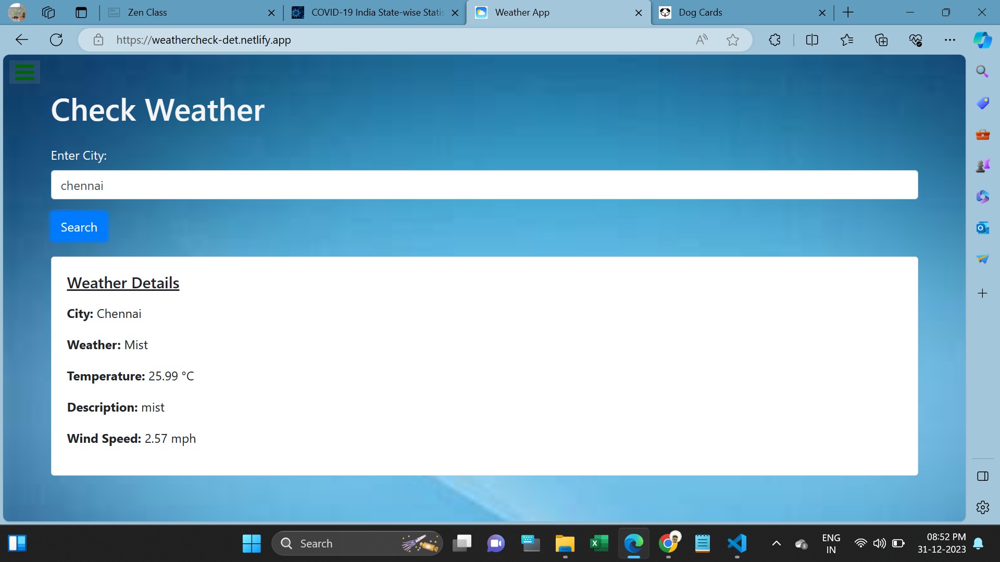

<h1>Weather API</h1>

This webpage is used to Check weather in city.

In this page contain weather information for the place.

Users first Enter city name (Eg.,chennai) then getting weather information after submission.

I used Html,CSS,Bootstrap,Javascript Promise method using fetch API for developing this page.

I attached Webpage Screenshots in below:
   

<h2>Website URL</h2>
https://weathercheck-det.netlify.app/

<h2>Screenshots</h2>

1. Its main web page

 

2. Checking Weather

 
